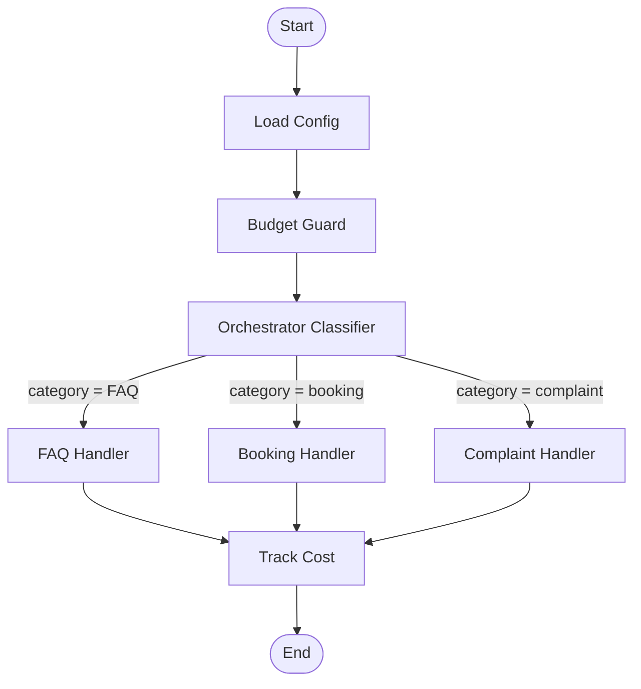

# FixIt AI Support LLMOps

This project is a beginner-friendly reference implementation of the FixIt AI
support workflow described in your system design doc. It uses:

- external YAML config for routing, models, prompts, feature flags, and budget rules
- a two-stage flow: classify first, answer second
- deterministic routing after classification
- prompt versioning
- model downgrade and fallback rules for budget control
- unit and integration tests

The code is intentionally simple to read. By default, it runs in a local mock
mode so you can understand the workflow without needing real API keys.

## Architecture Diagram



## How It Works

1. `load_config` loads YAML files from `config/`.
2. `budget_guard` checks monthly spend and daily volume.
3. `orchestrator_classifier` classifies the query into:
   - `category`
   - `complexity`
   - `response_type`
4. The matching handler uses deterministic routing rules from `routing.yaml`.
5. The handler loads the prompt, picks the model, and generates a response.
6. `cost_tracker` estimates token usage and query cost.

## Project Structure

```text
fixit/
├── app/
├── config/
├── prompts/
├── tests/
├── requirements.txt
├── README.md
├── .env.example
└── pyproject.toml
```

## Running The App

Set up the project with `uv`:

```bash
uv sync --dev
```

Run the workflow with a sample query:

```bash
uv run python -m app.main "Can I reschedule my cleaning appointment?"
```

Example output:

```json
{
  "classification": {
    "category": "booking",
    "complexity": "medium",
    "response_type": "standard"
  },
  "route": {
    "handler": "booking_handler",
    "model": "standard",
    "prompt": "booking.standard"
  }
}
```

## Running Tests

```bash
uv run pytest
```

## Notes For Beginners

- Start with `app/main.py` to see the app entry point.
- Then open `app/graph.py` to understand the workflow order.
- Each file in `app/nodes/` is one step in the workflow.
- Most business logic lives in `app/services/`.
- The prompts are regular YAML files, so updating them does not require code changes.
- The config files are separated by responsibility to make changes safer.

## Important Implementation Note

The included `LLMClient` is mock-first on purpose. That makes the project easy
to run locally and easy to test. If you want to connect a real provider later,
you only need to expand `app/services/llm_client.py`.
